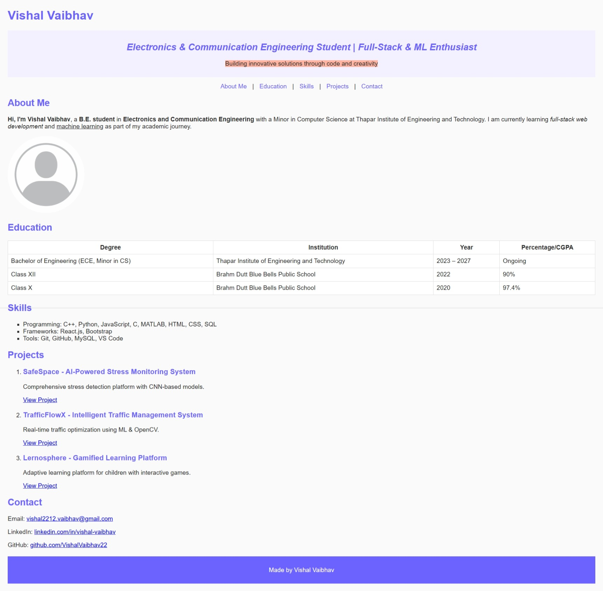

# Assignment 1 – Personal Portfolio Website

This is Assignment 1 for the UCS542 UI & UX Specialist course.

## Features
- HTML & CSS single-page layout
- Headings, text formatting, and links
- Profile image with attributes
- Education table with rowspan
- Skills list
- Contact section and footer

## Run
Open `index.html` in a browser.

## Website Preview

