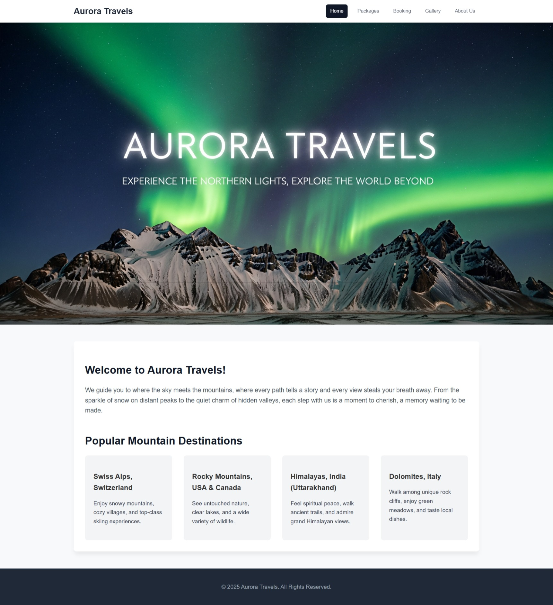

# Assignment 2 – Aurora Travels Website

This is Assignment 2 for the UCS542 UI & UX Specialist course.

## Features

* HTML5 & CSS3 multi-page layout
* Sticky navigation header and footer
* Modern card-based layouts
* Clean, semantic HTML and a single stylesheet

## Run

Open `index.html` in a browser.

## Website Preview

