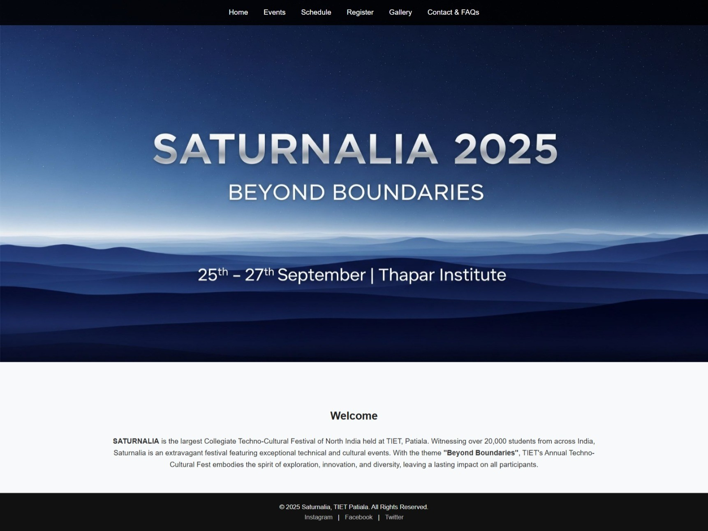

# Assignment 3 – College Fest Multi-Page Website  

This is Assignment 3 for the **UCS542 UI & UX Specialist** course.  

## Features  
- Multi-page **HTML5 & CSS3** website for college fest *Saturnalia 2025*  
- Sticky navigation header and footer across all pages  
- Aesthetic **banner-based homepage** with theme *"Beyond Boundaries"*  
- **Events page** with competition details (Robo War, Film Mania, Unplugged, Bazinga, Hackathon)  
- **Schedule page** with responsive event schedule/results table  
- **Registration form** for participant details  
- **Photo gallery** in a responsive grid  
- **Contact & FAQ page** with styled sections for better readability  
- Unified design with a **single external stylesheet (style.css)**  

## Pages  
- `index.html` – Homepage with banner and intro  
- `events.html` – List of competitions  
- `schedule.html` – Event schedule/results  
- `register.html` – Participant registration form  
- `gallery.html` – Photo gallery  
- `contact.html` – Contact info & FAQs  

## Run  
Open **`index.html`** in any modern browser.  

## Website Preview  
  
