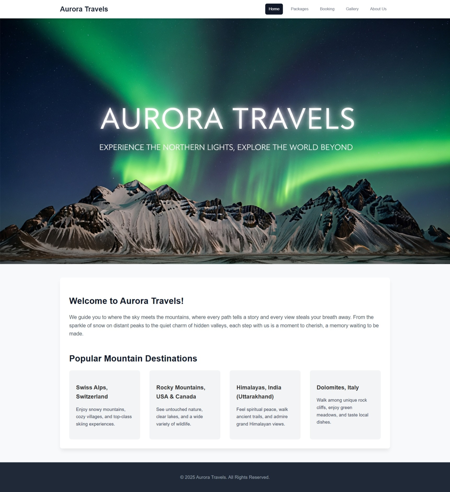

# Aurora Travels - Assignment 6

An interactive, multi-page responsive website for the Aurora Travels agency. This project enhances the static website from Assignment 2 by introducing dynamic functionality using JavaScript. It was completed for Assignment 6 of the UCS542 UI & UX Specialist course.

## Website Preview

## Core Features & Technologies

* **HTML5:** Clean and semantic page structure.
* **CSS3:** A single stylesheet for modern, responsive styling.
* **JavaScript (ES6+):** Used to create an interactive user experience, including:
    * **Dynamic Packages Table:** The travel packages on the "Packages" page are generated directly from a JavaScript array.
    * **Live Booking Calculator:** The "Booking" page features a form with real-time price estimation based on user selections, dates, and promo codes.
    * **Interactive Photo Gallery:** Thumbnails on the "Gallery" page open a full-size image in a pop-up modal window.
    * **Active Navigation Highlighting:** The current page is automatically highlighted in the navigation bar.

## How to Run

Simply open the `index.html` file in any modern web browser.